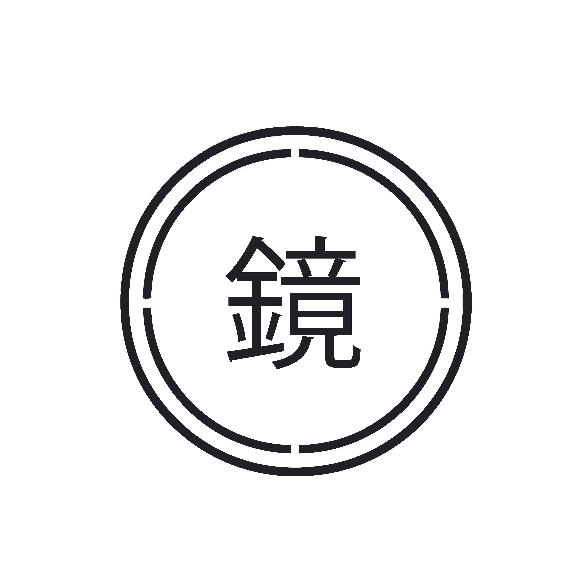
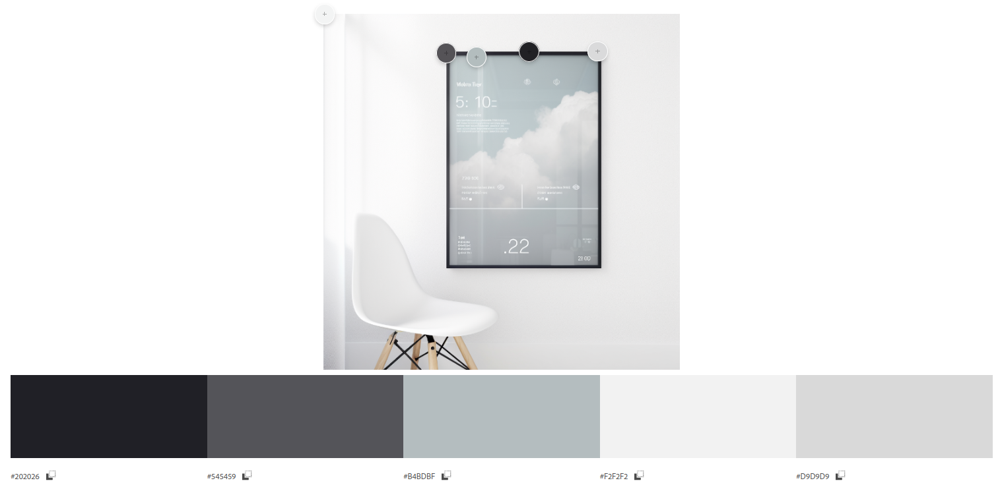
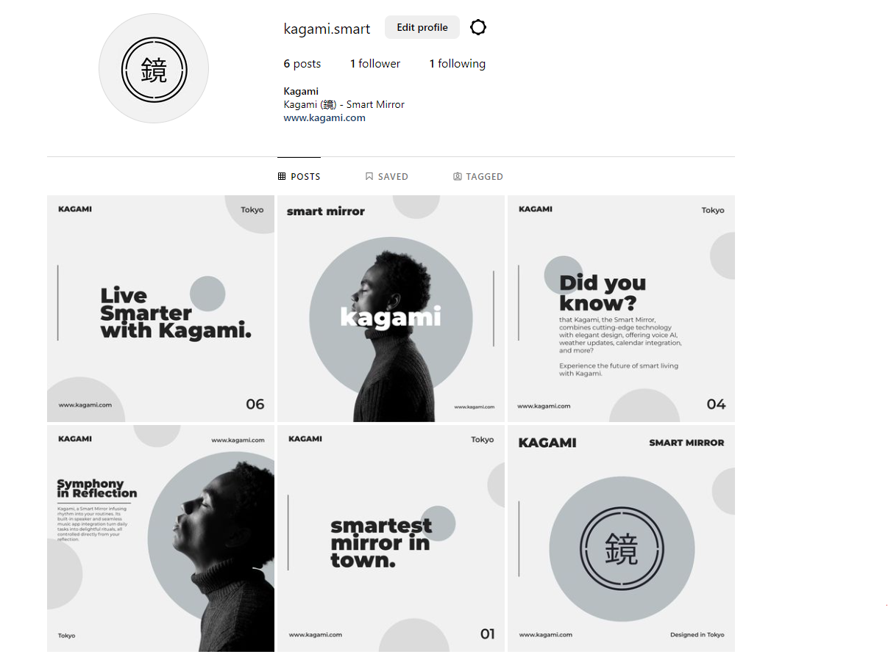
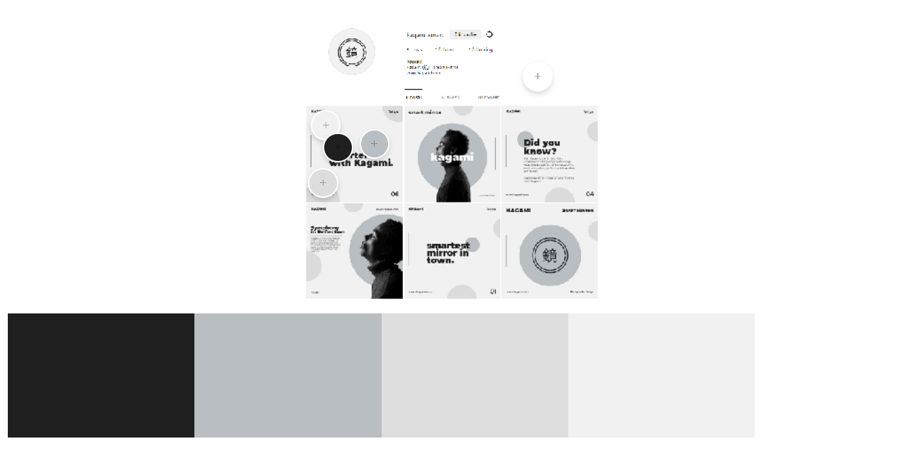

# Kagami (鏡) - Smart Mirror

## Concept Description
- website
- instagram profile
- working voice ai prototype

## Roles
- Visual Designer: Luca
- Website Developer: Carl
- Voice AI Developer: Luca
## Functionality of Kagami
- voice ai
- weather
- calendar
- email
- widgets (plugins)
- news
- outfit suggestions
- music
- smart home control

# Design and Materials

Kagami, the Smart Mirror, is a masterpiece of design and craftsmanship. Every detail has been meticulously considered to create a truly elegant and modern addition to your living space.

## Sleek and Slim Profile

Kagami features a sleek and slim profile that seamlessly blends into any environment. Its minimalist design exudes sophistication, with clean lines and a refined aesthetic that adds a touch of elegance to any room.

## Premium Materials

Crafted with the utmost attention to quality, Kagami is built to stand the test of time. It features a frame meticulously crafted from titanium alloy, a premium material known for its exceptional strength and luxurious appeal.

- Crystal-clear Reflection: The mirror surface is crafted from high-quality, distortion-free glass, ensuring a flawless and crystal-clear reflection that enhances your viewing experience.

- Exquisite Frame: The frame of Kagami is meticulously constructed from titanium alloy, chosen for its unparalleled strength and sleek aesthetic. This premium material offers a modern and sophisticated look, adding a touch of refined luxury to your space.

- Longevity and Resilience: Every component of Kagami is designed to withstand the rigors of daily use. The titanium alloy frame not only provides a stunning visual appeal but also ensures durability and resilience, making your Smart Mirror a reliable and long-lasting addition to your home.

Immerse yourself in the elegance and durability of Kagami, where the combination of high-quality, distortion-free glass and a titanium alloy frame creates a Smart Mirror that is visually stunning, luxurious, and built to last.

## Seamless Integration

Kagami seamlessly integrates into your home decor, with a design that complements any style. Whether it's a modern, contemporary, or classic setting, the Smart Mirror effortlessly becomes a focal point, elevating the ambiance of the room.

## Privacy-Focused Design

We understand the importance of privacy, and that's why Kagami has been thoughtfully designed to ensure your peace of mind. The inbuilt camera comes with a privacy cover, allowing you to control when it's in use and providing you with complete control over your privacy.

## Ergonomic and Intuitive

Kagami's design goes beyond aesthetics—it's also designed for ease of use. The user interface is intuitive and responsive, ensuring a seamless and effortless interaction. With a simple touch or voice command, you can navigate through the features and functions of Kagami with ease.

## Future-Proofed

Kagami is designed with the future in mind. Its modular construction allows for easy upgrades and expansion, ensuring that it remains at the cutting edge of technology. As new features and advancements emerge, you can easily incorporate them into your Kagami Smart Mirror, keeping it relevant and up to date.

Immerse yourself in the captivating design and premium materials of Kagami, the Smart Mirror that seamlessly blends technology and style, creating a truly remarkable addition to your home.

# Widget and Functionality of Kagami
## Weather Website Text

Introducing Kagami. Unleash the power of weather intelligence with unparalleled precision. Elevate your style with fashion-forward outfit recommendations that seamlessly adapt to any forecast. Effortlessly sync your wardrobe to weather conditions, creating a harmonious blend of fashion and functionality. Unleash your adventurous spirit as you plan outdoor activities confidently, armed with real-time insights and vital weather data. Step into a world of limitless possibilities and embrace the ultimate weather guidance experience with Kagami.

## Smart Home Control
Kagami is your hub for a truly connected living experience. Tap into the pulse of your smart home with unrivaled control and convenience. Elevate your daily routine with personalized automation that adapts seamlessly to your lifestyle. Effortlessly synchronize your devices, creating a harmonious ecosystem that breathes with your rhythm.

Unleash the power of cutting-edge AI as Kagami anticipates your needs, adjusts your surroundings, and orchestrates your smart home with precision. Step into a world of smart living, where technology serves you, not the other way around. Embrace the ultimate smart home experience with Kagami. Control. Convenience. Customization. All in one mirror.

## Smart Home Control v2
Kagami puts the command of your domain at your fingertips, offering an integrated Smart Home Widget for controlling your devices, adjusting settings, and creating the perfect ambiance, all from your reflection. Keep a watchful eye on your surroundings with live views from your security cameras, ensuring you're always connected and secure. Enjoy personalized comfort with the ability to adjust your home's temperature directly from your mirror, creating a space that's as cozy or cool as you desire. Automate your smart devices to move to your rhythm with smart routines, crafting personalized experiences that enhance your everyday life. The Smart Mirror, reflecting not just you, but the essence of your smart home.

## Stock Widget
Kagami, now with an integrated Stock Widget. Experience the power of staying updated with your investments while you prepare for the day. The real-time Stock Widget acts as a gateway to your financial world, right from your reflection. Monitor your portfolio, follow your favorite stocks, and catch a quick glimpse of market trends, all as you go about your morning routine. With live, seamless updates, the Smart Mirror moves as the market does, ensuring you're always ahead of the curve. Personalize your experience with alerts for your top picks, so you never miss a key moment in your financial journey. The Smart Mirror, seamlessly blending your daily rituals with your financial world.

## Music
Kagami transforms your daily routines into symphonic experiences. Crafted with an intuitive music widget, control your tunes directly from your reflection, ensuring you never miss a beat while preparing for your day. Hidden within the elegant confines of the mirror is a marvel of acoustic engineering - an inbuilt speaker delivering crystal clear sound that fills your space, turning mundane routines into delightful rituals. With seamless Spotify and Apple Music support, your Smart Mirror dances to your tunes. Instantly access your playlists, discover new music, or tune into your favorite podcast, all from your mirror. Kagami, redefining your morning rituals.

## Outfit recommendations
Presenting the Smart Mirror, a personal stylist that seamlessly integrates technology and fashion to enhance your style. Equipped with an inbuilt camera, tastefully hidden with a privacy cover, the Smart Mirror captures your look and offers personalized outfit recommendations directly from your reflection. With a real-time weather data integration, the Smart Mirror keeps you prepared for the day ahead, suggesting attire that matches the forecast. But it doesn't stop there. The Smart Mirror adds a unique touch to your fashion choices, learning your style over time to provide recommendations that perfectly suit your personal aesthetic. With the Smart Mirror, every day is a new opportunity to shine, one reflection at a time.

## News Widget
Stay informed with curated headlines, real-time updates, and customizable feeds, all at a glance. Dive into articles or listen to briefings effortlessly. Stay connected, stay informed, with Kagami.

 ## Clendar
 Effortlessly stay organized with integrated calendar features that display upcoming events, tasks, and to-do lists. Never miss an important meeting or deadline with visual reminders at your fingertips. The Smart Mirror synchronizes seamlessly with your preferred calendar app, ensuring your schedule is always up to date across all your devices. Customize your calendar display to match your style and preferences, with various layouts and color schemes available. Kagami, reflecting your productivity and keeping you in control of your schedule.

 # Color Palette
 

# Styleguide
## Colors
 #202026, #545459 , #B4BDBF , #F2F2F2 , #D9D9D9

### 1. Midnight Mirage #202026
This deep, sophisticated hue is the primary color for Kagami's brand identity. It is used for the logo, texts, and any element that needs to stand out. It embodies the sophistication and elegance of the Kagami Smart Mirror. Use it sparingly to maintain its impact.

### 2. Grey Nickel #545459
This rich grey is our secondary color, offering a sleek, modern, and versatile color to complement Midnight Mirage. Use it for secondary texts, icons, borders, and subtle accents.

### 3. Metallic Silver #B4BDBF
Metallic Silver serves as our accent color, used to highlight specific information and for interactive elements like buttons and links. This color reflects the premium materials used in Kagami, symbolizing its high-quality construction.

### 4. Whisper White #F2F2F2
Whisper White is used as a background color, creating a clean and uncluttered look that enhances the user interface's simplicity and readability. It provides an excellent contrast to our primary and secondary colors.

### 5. Light Silver #D9D9D9
Light Silver is the color for neutral backgrounds and elements that need to be visually differentiated from Whisper White. Use it for secondary backgrounds, form fields, and separators.

## Color Application

### Website
The Kagami website should be primarily Whisper White (#F2F2F2) and Light Silver (#D9D9D9) for an open and airy feeling. Text should be mainly Midnight Mirage (#202026) for readability and Grey Nickel (#545459) for secondary information. Call to action buttons, links, or any interactive elements should be accented with Metallic Silver (#B4BDBF).

### Instagram Profile
Use the color palette consistently across all Instagram posts to create a cohesive brand image. Midnight Mirage (#202026) should be used for text overlays and other graphic elements. The Metallic Silver (#B4BDBF) can be used for accent elements, while Grey Nickel (#545459) can be used for secondary text and elements.

### Voice AI Prototype
The Voice AI Prototype should follow the same color scheme to ensure brand consistency. Whisper White (#F2F2F2) and Light Silver (#D9D9D9) should be the primary colors for the user interface background, with Midnight Mirage (#202026) used for important text and Grey Nickel (#545459) for secondary text. Use Metallic Silver (#B4BDBF) for buttons, user input fields, and other interactive elements.

### Widgets (Plugins)
For the Kagami widgets, the color scheme needs to follow the same color distribution. The background should be Whisper White (#F2F2F2) and Light Silver (#D9D9D9). Text, borders, and icon colors should be Midnight Mirage (#202026) and Grey Nickel (#545459). Metallic Silver (#B4BDBF) should be used for interactive elements such as buttons and toggles.

# Instagram
## Implementation
### Instagram Web

[instagram.com/kagami.smart](https://www.instagram.com/kagami.smart/)
## Documentation: Instagram Profile Design
As part of the expansive reach of Kagami Smart Mirror, an Instagram page has been diligently curated. Six distinct visuals, each one capturing different facets of our innovative product, have been meticulously designed and positioned on our page.

The process of image creation was managed within the versatile digital landscape of Adobe Photoshop. We utilized a custom design template, crafted to maintain the consistency of our visual storytelling, ensuring each image synergistically complements the others, creating a harmonious layout.

The visual narrative of the Instagram profile adheres strictly to our carefully selected color palette, staying true to the style guide. The visuals resonate with the colors - Midnight Mirage, Grey Nickel, Metallic Silver, Whisper White, and Light Silver, imbibing the aesthetic essence of Kagami Smart Mirror.

The Instagram profile functions as a digital platform to spotlight the sophistication, functionality, and elegance of Kagami, enabling followers to immerse themselves in the experience that is our Smart Mirror. It's more than just an Instagram page; it's a window into the world of Kagami.

# Webpage Creation
## Introduction

This documentation provides a detailed overview of the process involved in creating a webpage using HTML, CSS, and JavaScript. It covers the languages used, the implementation of different components, and the deployment of the project.

## Languages Used

The webpage was created using the following languages:

### HTML

HTML (HyperText Markup Language) was used to create the main structure of the webpage. It defines the content, including images, text, and other elements.

### CSS

CSS (Cascading Style Sheets) was used to give the webpage the desired look and feel. It was used to define the colors based on the style guide and apply them to the webpage. CSS was also responsible for animating the fade-in and fade-out effects of text during scrolling.

### JavaScript

JavaScript was primarily used for implementing the scrolling effect and the rotating logo. The scrolling effect involved detecting the position of the viewport on the page and changing the opacity of text accordingly. The rotating logo was achieved using ThreeJS, a JavaScript framework for working with 3D objects rendered inside the browser using WebGL.

### ThreeJS

ThreeJS was utilized to create the rotating logo. It is a JavaScript framework for working with 3D objects and rendering them in the browser using WebGL. By creating a scene and a camera, the framework allows for the addition of 3D objects and lighting to create the desired visual scene. In this case, the 3D logo in OBJ format was loaded using an OBJLoader and assigned a black mesh material.

## Process

### Mockup

The initial step involved creating a mockup of the homepage using AdobeXD, a design tool similar to Figma. The mockup served as a reference for the webpage's layout and design. Although it was possible to export the mockup directly into HTML and CSS, this approach resulted in bloated code with approximately 8000 lines. Hence, it was decided to code the webpage manually, referring to the mockup.

### 3D Logo

The logo designed by Luca was taken and imported into Photoshop. The 3D extrude feature in Photoshop was used to create a 3D object with a depth of 50 pixels. The file was then exported in OBJ format to be imported and utilized with ThreeJS for the rotating logo effect.

### Coding

The coding process involved the following steps:

1. Creation of Main Containers: Five main containers were created based on the style guide, each assigned a background color specified in the guide.

2. Placement of Images and Text: Images and text content were placed within the containers, following the layout and design outlined in the mockup.

3. CSS Styling: The webpage was styled using flexboxes, desired fonts, and other CSS properties. The goal was to achieve the desired visual presentation and layout as per the mockup.

4. ThreeJS Integration: A ThreeJS scene was created inside a flexbox container located at the top of the page, next to the logo. This allowed for the rendering and manipulation of the 3D rotating logo.

## Deployment

The project was deployed as a static webpage using Render, a hosting platform. Render facilitates the deployment of static pages directly from a GitHub or GitLab repository. It provides an easy and streamlined process for deploying not only static pages but also web services like Node.js and Ruby on Rails projects.

By utilizing Render, the webpage was made accessible to users, allowing them to view and interact with the content through a web browser.