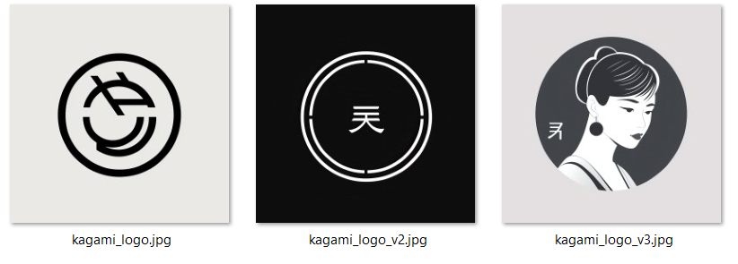
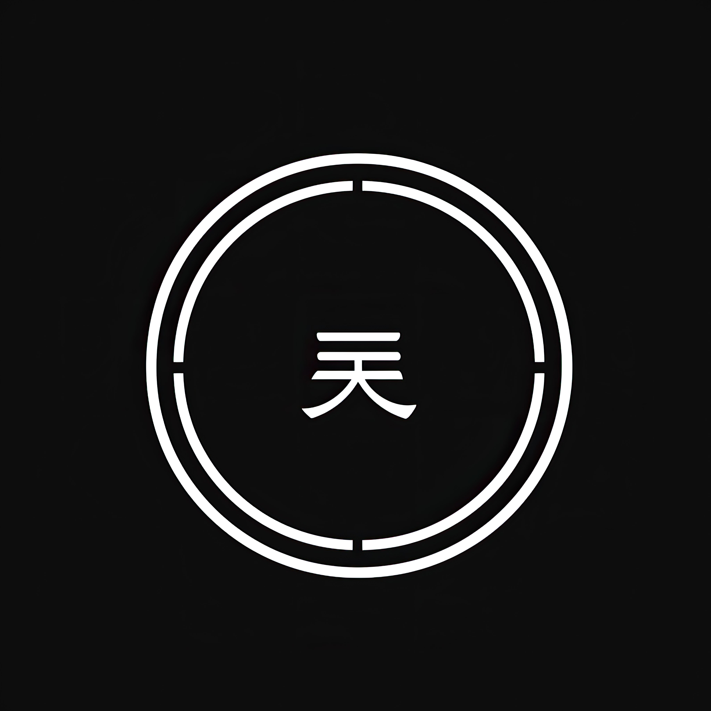
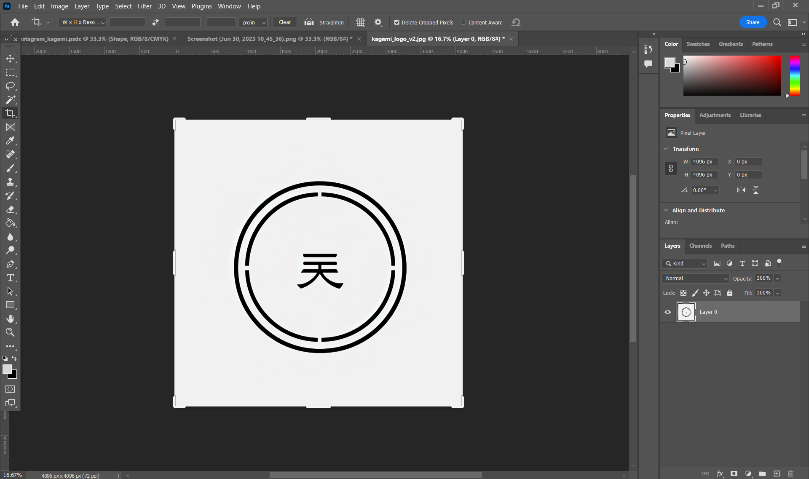
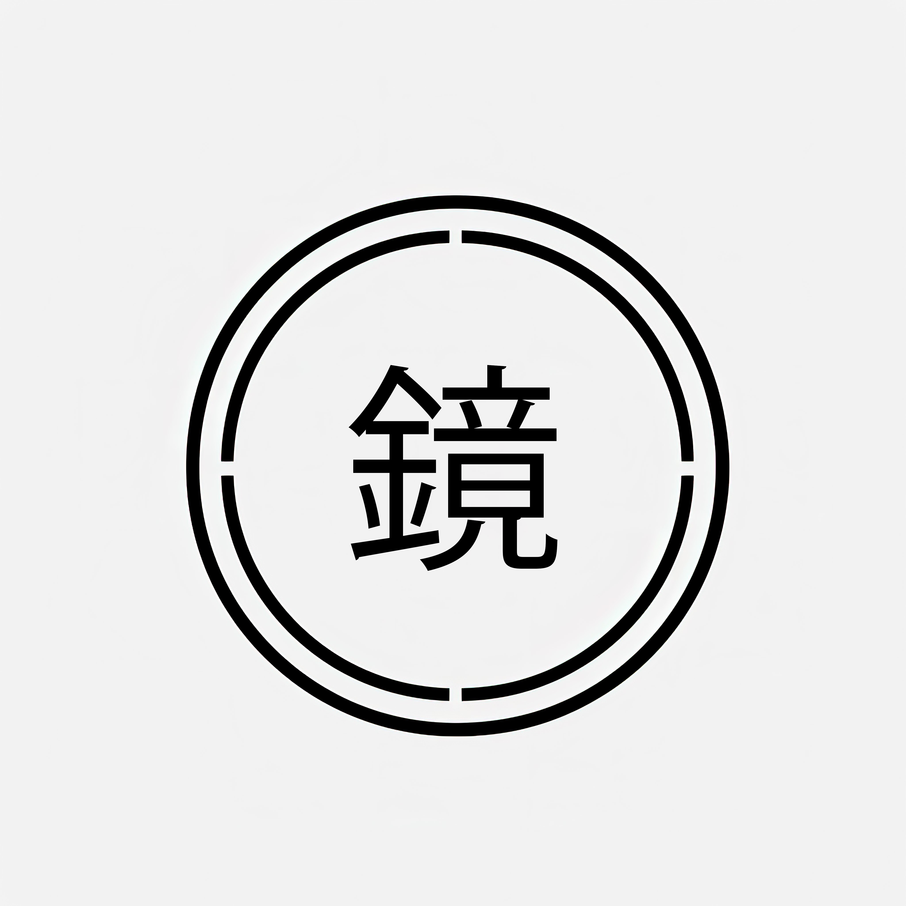

 # Color Palette
 

# Styleguide
## Colors
 #202026, #545459 , #B4BDBF , #F2F2F2 , #D9D9D9

### 1. Midnight Mirage #202026
This deep, sophisticated hue is the primary color for Kagami's brand identity. It is used for the logo, texts, and any element that needs to stand out. It embodies the sophistication and elegance of the Kagami Smart Mirror. Use it sparingly to maintain its impact.

### 2. Grey Nickel #545459
This rich grey is our secondary color, offering a sleek, modern, and versatile color to complement Midnight Mirage. Use it for secondary texts, icons, borders, and subtle accents.

### 3. Metallic Silver #B4BDBF
Metallic Silver serves as our accent color, used to highlight specific information and for interactive elements like buttons and links. This color reflects the premium materials used in Kagami, symbolizing its high-quality construction.

### 4. Whisper White #F2F2F2
Whisper White is used as a background color, creating a clean and uncluttered look that enhances the user interface's simplicity and readability. It provides an excellent contrast to our primary and secondary colors.

### 5. Light Silver #D9D9D9
Light Silver is the color for neutral backgrounds and elements that need to be visually differentiated from Whisper White. Use it for secondary backgrounds, form fields, and separators.
## Logo Design
Creating the perfect logo for our Kagami Smart Mirror was quite the adventure. We started our journey by using a cool tool called 'midjourney', which is really great at generating simple, clean logos with a Japanese touch.

We got a bunch of options, but three of them really stood out. After some good chats and a few cups of coffee, Carl and I decided that the middle one was just right. It felt like it had the Kagami vibe we were after.

Next, we jumped into Photoshop and inverted the colors, so that the logo resides on a white background. Which is the clean style we are after.

Then, to make it truly ours, we replaced the original symbol in the logo with the Kagami Kanji symbol. 'Kagami' means 'mirror' in Japanese, so it was the perfect fit for our smart mirror.

Finally, we colored our logo using the unique Kagami colors from our style sheet. We used 'Midnight Mirage' for the main bits and 'Whisper White' for the highlights.

Here's the final version of our logo.

# Instagram
# Widgets